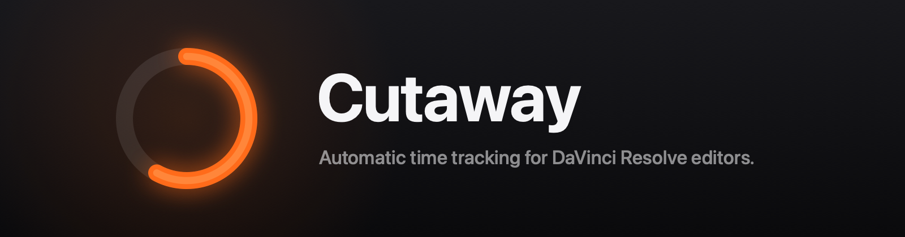
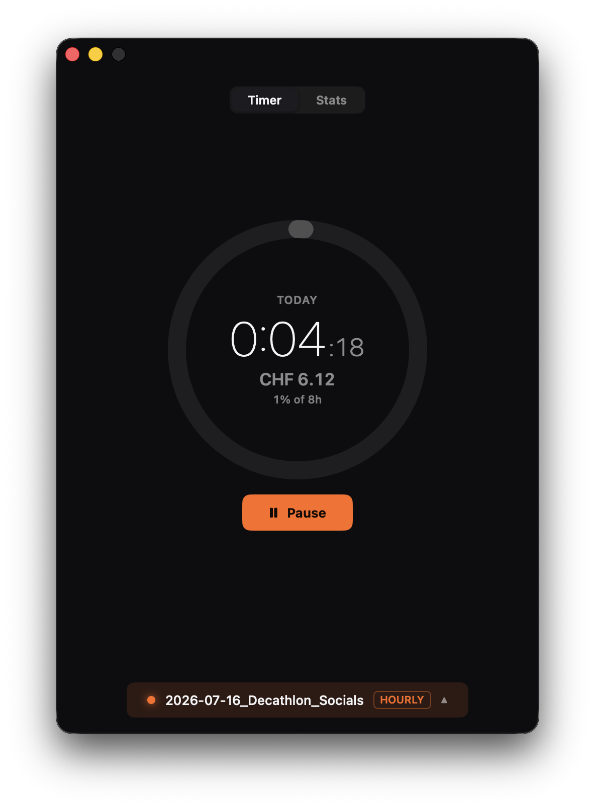
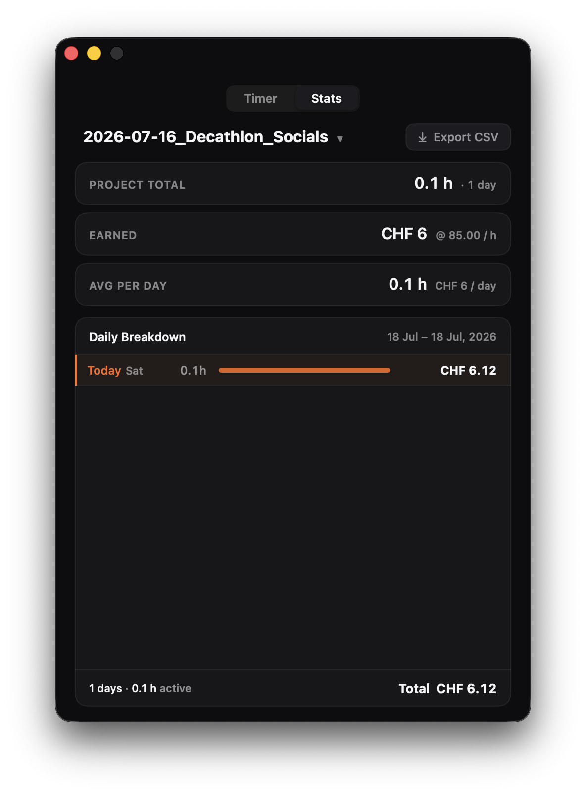

<p align="center">
  
</p>

<p align="center">
  <b>Automatic time tracking for DaVinci Resolve editors.</b><br>
  Your timer starts when you start editing. It stops when you stop. That's the whole idea.
</p>

---

## Install

```bash
brew install --cask svanlink/tap/cutaway
```

Two things on first run:

1. **Gatekeeper** — Cutaway is signed ad-hoc (no paid Apple Developer ID), so the first launch may warn about an unidentified developer. Right-click the app in `/Applications` and choose *Open* (once; macOS remembers) — or skip the warning entirely by installing with `brew install --cask --no-quarantine svanlink/tap/cutaway`.
2. **Accessibility (optional)** — lets Cutaway read Resolve's window title so it can follow project switches instantly. Cutaway works fine without it; detection just falls back to the scripting API and manual switching.

Requires macOS 14+. Works with [DaVinci Resolve](https://www.blackmagicdesign.com/products/davinciresolve) Free or Studio — and without Resolve at all, using manual projects.

**First invoice in two minutes:** open Cutaway → it detects your open Resolve project (or you create one) → set your hourly rate or budget → edit as usual → menu-bar pill shows the day building up → *Stats → Export CSV* when it's invoice time.

Updating and removing:

```bash
brew upgrade --cask cutaway          # update
brew uninstall --zap --cask cutaway  # remove, including preferences
```

## What it looks like

| The timer | Your money |
|:--:|:--:|
|  |  |

A pill lives in your menu bar with today's tracked time. Its border is a tally light:

| | State | Meaning |
|--|-------|---------|
| 🟢 | Green | Recording — you're working, the clock is running |
| 🟡 | Amber | Paused — away, idle, or paused by you |
| 🔴 | Red | No project selected |

## How Cutaway thinks

Most timers make you remember to press a button. Cutaway watches how an editor actually works, and it has opinions about honesty — every rule below resolves ambiguity toward **under-billing**, because an invoice is only worth something if every line on it is defensible.

**Anchors.** DaVinci Resolve and the Adobe toolchain (After Effects, Photoshop, Premiere, Illustrator, Audition) prove you're in a work block. They start the clock — but only while you're actually providing input. An open Resolve with nobody home bills nothing.

**Satellites.** Editing isn't only editing. Research in a browser, a question to Claude or ChatGPT, a client email, a download from Dropbox — that's the job too. These apps *sustain* the clock, but only inside a **research window** (default 20 minutes) after your last anchor activity. Real research between edit blocks bills. An evening of browsing that never touches Resolve doesn't.

**The bridge.** Quick detours — Finder, a file dialog, thirty seconds anywhere — are forgiven retroactively if you come back within the grace period (default 3 minutes). Come back and the gap counts; don't, and it never did.

**Hard boundaries.** Manual pause (⌥⌘P, from anywhere) and system sleep are sacred. Time behind a pause is never billed, no matter what — not even by the bridge.

**Projects follow Resolve.** Cutaway asks Resolve which project is open and switches attribution automatically — local, network, or cloud libraries. Open a project Cutaway has never seen and it creates it on the spot.

## Billing

Two modes per project:

- **Hourly** — set your rate; Cutaway turns tracked time into earnings, live.
- **Fixed budget** — set the total (e.g. 4 500 CHF) and your internal rate; Cutaway shows a burn-down with amber/red warnings and a pace forecast: *"≈ 2.5 working days left at current pace."*

Currencies: CHF, EUR, USD, COP — formatted correctly for each. Daily goal ring in the main window (green when you beat it, overtime counted).

**CSV export** for invoicing: one row per worked day — sessions, first/last activity, active hours, rate, earnings, budget columns, cumulative totals — plus a summary block. Opens clean in Excel and Numbers.

## Privacy

Everything is local. No account, no network calls, no telemetry, ever. Your data is a SQLite file on your Mac that you own outright.

## Your data

- **Where it lives:** `~/Library/Application Support/` — a SQLite store (`default.store`) plus its journal files.
- **Automatic backups:** every launch, Cutaway snapshots your billing data to `~/Library/Application Support/Cutaway/Backups/` (skipped when nothing changed, newest 7 kept).
- **Restore:** quit Cutaway, copy the three files from the backup folder you want back into `~/Library/Application Support/`, relaunch.
- **Invoices:** the CSV export is the canonical hand-off — archive those alongside your invoices and the numbers survive anything.

## FAQ

**Resolve Free or Studio?** Both. Studio gets instant project detection via the scripting API; Free uses window titles (with Accessibility) or manual switching.

**What if Resolve renders for 20 minutes and I don't touch anything?** The idle threshold pauses the clock. If your workflow has long unattended renders, raise the idle threshold in Settings — your call, deliberately.

**Does it run at login?** There's a toggle in Settings. Off by default.

**Why is my antivirus/Gatekeeper suspicious?** The build is ad-hoc signed (no Apple Developer subscription), so macOS can't verify a developer identity. The source is all here — build it yourself if you prefer.

**Resolve isn't in /Applications — does detection still work?** Yes. Cutaway asks macOS where Resolve is actually installed and finds its scripting tool there.

**A client's Mac shows different number formats.** It won't: all billing figures and CSV output are locale-pinned, so a CSV exported in Bogotá matches one exported in Zürich byte for byte.

## Building from source

```bash
brew install xcodegen
git clone https://github.com/svanlink/cutaway.git && cd cutaway
xcodegen generate
xcodebuild -project Timex.xcodeproj -scheme Cutaway -configuration Release build
```

Run the verification loop (86 unit tests plus an end-to-end scenario harness that replays scripted work sessions against the full app):

```bash
xcodebuild -project Timex.xcodeproj -scheme Cutaway test
./scripts/smoke.sh "" 10
```

## License

[MIT](LICENSE) © vaneickelen
