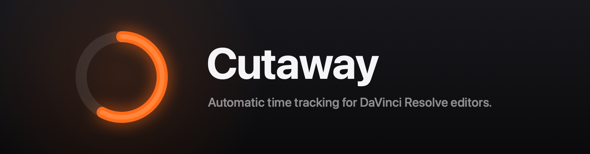
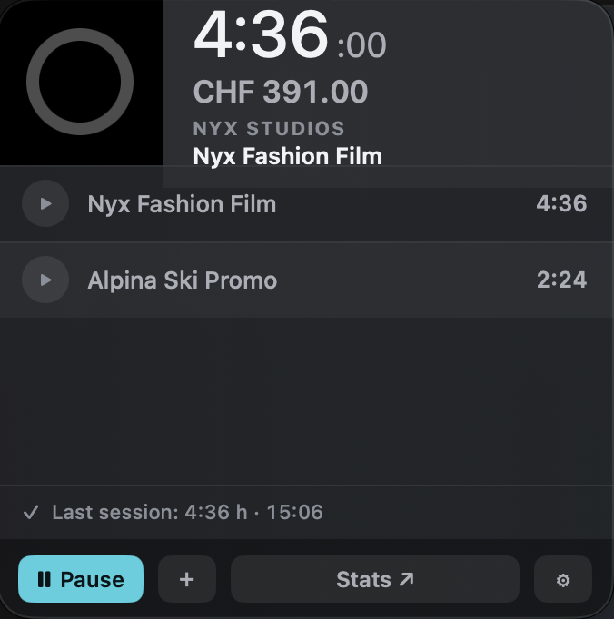
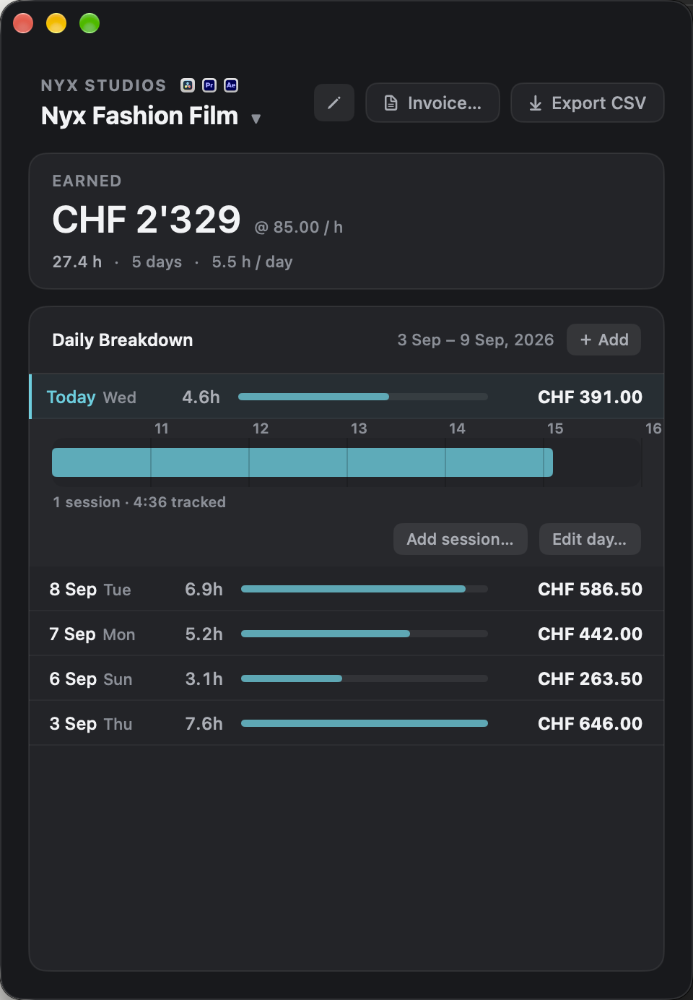

<p align="center">
  
</p>

<p align="center">
  <b>Automatic time tracking for DaVinci Resolve editors.</b><br>
  Your timer starts when you start editing. It stops when you stop. That's the whole idea.
</p>

---

## Install

```bash
brew install --cask svanlink/tap/cutaway
```

Two things on first run:

1. **Clear the quarantine flag after installing.** Cutaway is signed ad-hoc and deliberately not notarized: it is free, and a paid Apple Developer ID is not part of how it is published. macOS quarantines anything downloaded, and Homebrew is no exception — a cask cannot opt out of quarantine, only the person installing can. This README used to claim the cask removed the flag. It does not, and that claim was wrong.

   So after `brew install --cask svanlink/tap/cutaway`, run:

   ```
   xattr -d com.apple.quarantine /Applications/Cutaway.app
   ```

   Or install with `brew install --cask --no-quarantine svanlink/tap/cutaway` in the first place. Both are a deliberate Gatekeeper bypass — that is the price of not notarizing, and it is stated here rather than hidden.

   Skipping this is not cosmetic: since macOS 15 the right-click → *Open* bypass is gone, and macOS 26 reports an ad-hoc-signed quarantined app as damaged and offers to move it to the Trash. The GitHub zip exists because the cask downloads it — it is not the way to install by hand.

   The Release build does run with the **hardened runtime**, which is enforced by the kernel whether or not the app is notarized: an attacker cannot inject a dylib into a process that holds Accessibility.
2. **Accessibility (optional)** — lets Cutaway read Resolve's window title so it can follow project switches instantly. Cutaway works fine without it; detection just falls back to the scripting API and manual switching.

Requires macOS 14+. Works with [DaVinci Resolve](https://www.blackmagicdesign.com/products/davinciresolve) Free or Studio — and without Resolve at all, using manual projects.

**First invoice in two minutes:** open Cutaway → it detects your open Resolve project (or you create one) → set your hourly rate or budget → edit as usual → menu-bar pill shows the day building up → *Stats → Export CSV* when it's invoice time.

**Where your data lives:** `~/Library/Application Support/Cutaway/billing.store` (since 1.3.2; earlier versions used the shared `default.store`, which other SwiftData apps also write to — Cutaway adopts it once and never deletes it). Backups in `Cutaway/Backups/`: at launch, once a day while running, at quit, (a consistent SQLite snapshot; 7 generations, plus each day's newest for 30 days, plus the oldest one forever). To restore: Settings › Data › Restore…, pick a `billing-*` folder, and Cutaway relaunches with it — the replaced store is kept beside it. Any backup opens, whatever the store file inside is called, including ones from before the app was renamed. If the store is ever damaged, Cutaway does **not** replace it on its own: it stops at launch and shows you the reason, the newest backup it can actually read, when that backup was taken and how many work sessions it holds — then Restore, Open Backups Folder, or Continue Without Restoring. Continuing runs in memory and leaves the damaged file untouched, so nothing is destroyed by a wrong guess. A store that merely cannot be *opened* right now — a permissions problem, a full disk, a Time Machine lock — is never treated as damaged; those heal, and a restore would drop the minutes since the backup.

**Releasing** (maintainer): push a tag `vX.Y.Z`. CI tests, builds, ad-hoc signs, publishes the GitHub release and bumps the cask — the cask step needs a `TAP_TOKEN` repository secret with write access to `svanlink/homebrew-tap`. `scripts/release.sh` remains the local fallback and is the only path that also runs the smoke harness (it needs a GUI session).

Updating and removing:

```bash
brew upgrade --cask cutaway          # update
brew uninstall --zap --cask cutaway  # remove, including preferences
```

## What it looks like

| The panel | Your money |
|:--:|:--:|
|  |  |

A pill lives in your menu bar with today's tracked time. Its border is a tally light:

| | State | Meaning |
|--|-------|---------|
| 🟢 | Green | Recording — you're working, the clock is running |
| 🟡 | Amber | Paused — away, idle, or paused by you |
| 🔴 | Red | No project selected |

## How Cutaway thinks

Most timers make you remember to press a button. Cutaway watches how an editor actually works, and it has opinions about honesty — every rule below resolves ambiguity toward **under-billing**, because an invoice is only worth something if every line on it is defensible.

**Anchors.** DaVinci Resolve and the Adobe toolchain (After Effects, Photoshop, Premiere, Illustrator, Audition) prove you're in a work block. They start the clock — but only while you're actually providing input. An open Resolve with nobody home bills nothing.

**Satellites.** Editing isn't only editing. Research in a browser, a question to Claude or ChatGPT, a client email, a download from Dropbox — that's the job too. These apps *sustain* the clock, but only inside a **research window** (default 20 minutes) after your last anchor activity. Real research between edit blocks bills. An evening of browsing that never touches Resolve doesn't.

**The bridge.** Quick detours — Finder, a file dialog, thirty seconds anywhere — are forgiven retroactively if you come back within the grace period (default 3 minutes). Come back and the gap counts; don't, and it never did.

**Hard boundaries.** Manual pause (⌥⌘P, from anywhere) and system sleep are sacred. Time behind a pause is never billed, no matter what — not even by the bridge.

**Forgotten pauses.** Pause for a call, come back, edit for an hour — and never notice the amber pill. Cutaway watches for that: once you've been actively editing in Resolve (or another workflow app) for about 45 seconds while paused, it asks *"Are you working?"* in a small card under the menu bar — one click resumes, no permission needed. The panel shows the same question with a Resume button, and the pill reads *paused · working?*. The pause stays sacred backwards: nothing before the resume is ever billed, including those 45 seconds. Prefer it to stop asking? The card's *Always* button resumes and turns on automatic resume from then on. Browsers never trigger this; only workflow apps do.

**Two questions, never at once.** Cutaway interrupts for exactly two things — *Still working?* before an idle pause, and *Are you working?* when you edit through a manual pause — each a small card under the menu bar that never steals focus. Everything else is in the panel.

**Projects follow Resolve.** Cutaway asks Resolve which project is open and switches attribution automatically — local, network, or cloud libraries. Open a project Cutaway has never seen and it creates it on the spot.

**Projects know their apps.** When you create a project, tick the apps it's worked in — DaVinci Resolve, the Adobe suite, Office, anything installed. Everything you normally use starts ticked, so most projects need no clicks; an InDesign-only template job is an untick. While a project is selected, only its apps count toward it: a colour pass in Resolve can't land on the wrong invoice. Icons are the real ones from the apps on your Mac.

## Billing

Two modes per project:

- **Hourly** — set your rate; Cutaway turns tracked time into earnings, live.
- **Fixed budget** — set the total (e.g. 4 500 CHF) and your internal rate; Cutaway shows a burn-down with amber/red warnings and a pace forecast: *"≈ 2.5 working days left at current pace."*

Currencies: CHF, EUR, USD, COP — formatted correctly for each.

**CSV export** for invoicing: one row per worked day — sessions, first/last activity, active hours, rate, earnings, budget columns, cumulative totals — plus a summary block. Opens clean in Excel and Numbers.

**Everything is editable — and it says so.** Expand any day in *Stats → Daily Breakdown* and choose *Edit day…* (or right-click the row) to correct its time — type hours (`1:30`, `1.5`, `90m`) or type the amount and the hours follow from your rate. *＋ Add* enters a day Cutaway never saw. Right-click a project in the switcher → *Edit…* to change its name, client, rate, budget, mode or currency. Corrections trim or extend the recorded sessions, so first/last activity in the CSV stays truthful — and typed time is marked: a pencil on the day, and an `adjusted_hours` column in the CSV, so every line on an invoice says whether it was tracked or entered.

## Privacy

Everything is local. No account, no network calls, no telemetry, ever. Your data is a SQLite file on your Mac that you own outright.

## FAQ

**Resolve Free or Studio?** Both. Studio gets instant project detection via the scripting API; Free uses window titles (with Accessibility) or manual switching.

**What if Resolve renders for 20 minutes and I don't touch anything?** The clock pauses, and Cutaway bills nothing for it. There used to be an opt-in that kept billing while the CPU looked busy; it was deleted in 1.3.2 as the one rule in the app that billed time nobody worked. If you do bill unattended renders, either raise *Pause after no input for* in Settings, or enter the time afterwards in *Stats → Edit day…*, where it is marked as entered rather than tracked.

**Does it run at login?** There's a toggle in Settings. Off by default.

**Why is my antivirus/Gatekeeper suspicious?** The build is ad-hoc signed (no Apple Developer subscription), so macOS can't verify a developer identity. The source is all here — build it yourself if you prefer.

**Resolve isn't in /Applications — does detection still work?** Yes. Cutaway asks macOS where Resolve is actually installed and finds its scripting tool there.

**A client's Mac shows different number formats.** It won't: all billing figures and CSV output are locale-pinned, so a CSV exported in Bogotá matches one exported in Zürich byte for byte.

## Building from source

```bash
brew install xcodegen
git clone https://github.com/svanlink/cutaway.git && cd cutaway
xcodegen generate
xcodebuild -project Cutaway.xcodeproj -scheme Cutaway -configuration Release build
```

Run the verification loop (598 unit tests, 11 UI tests including an accessibility audit, plus an end-to-end scenario harness that replays eight scripted work sessions against the full app):

```bash
xcodebuild -project Cutaway.xcodeproj -scheme Cutaway test
./scripts/smoke.sh "" 10
```

## License

[MIT](LICENSE) © vaneickelen
